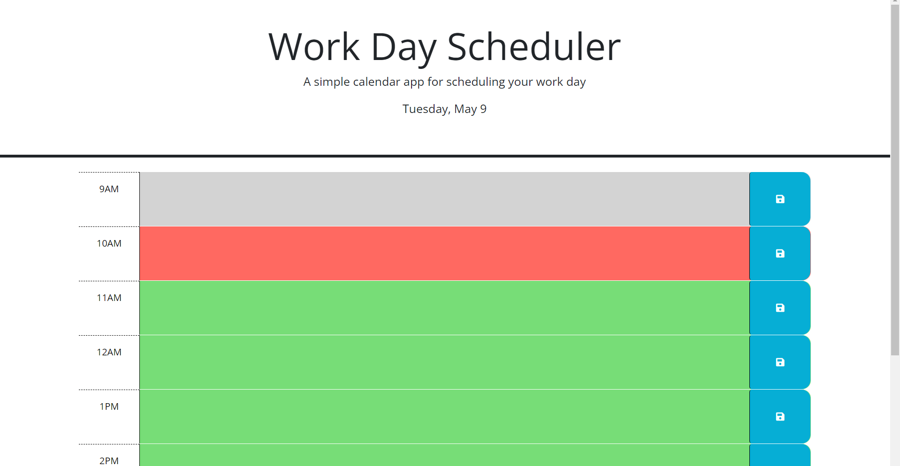

# Calendar Application
This is a calendar application that allows the user to save events for each hour of the day. The application runs in the browser and features dynamically updated HTML and CSS powered by jQuery.

# How to Use
Upon opening the application, the user will see the current day displayed at the top of the calendar. The user can scroll through the hours of the day and see which hours have passed, which hours are currently happening, and which hours are still to come.

Each hour block of the calendar is color-coded to indicate whether it is in the past, present, or future. The user can click on an hour block and enter an event for that hour. Once the event is entered, the user can save it by clicking the save button.

The events that the user enters will be saved in local storage, so they will still be there if the user refreshes the page or closes and reopens the browser.

# Technologies Used
This calendar application was created using HTML, CSS, and JavaScript.

# Credits
This project was created by [Daley Jones].

Link to my calender https://daleyjones.github.io/week-5-workday/  
# License
This project is licensed under the MIT License - see the LICENSE.md file for details.

